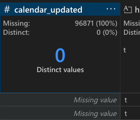
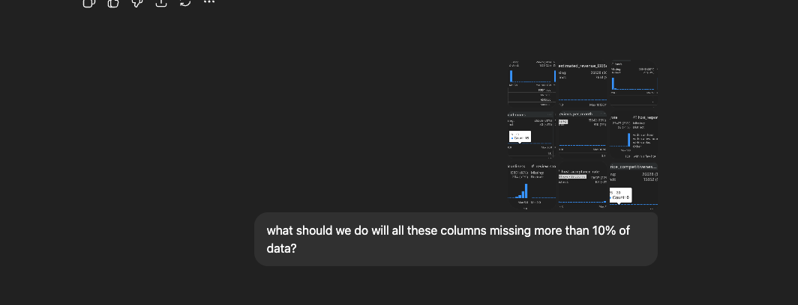

- i picked the airbnb dataset. i wanted to look at it from the business perspecive
- first i had to assess the data to see what was wrong with it or if it needed futher dirtying
- first things first my data contains 96,000 rows and 79 columns.
- within that these are the things i noticed about the dataset:

  - there is heavy missing data:

    - some columns are missing 100% data
      
    - neighbourhood group, neighbourhood group cleansed, and license
    - there are another 11 columns with more than 30% data missing

  - there are inconsistent data types
  - inconsistent casing

- halfway through i realised i have way too many columns to clean to look into individually
- i have 79 columns. so then i focused on what isnights i wanted to find
- this helped focus on what columns are needed and which ones can be ignored

- what insights am i interested:
  https://chatgpt.com/s/t_692f490eba3c81918c5bc911f3e797b2

1. Which neighborhoods generate the highest revenue?
2. Relationship between price and occupancy (demand curve)
3. Which property types outperform others?
4. Host behavior & responsiveness and how it affects performance
5. Impact of amenities on price
6. Cleaning fees vs. total revenue
7. What do highly rated listings have in common?
8. Price distribution & revenue potential by size (bedrooms/beds)
9. Heatmap of correlations across all numerical Airbnb metrics

for these insights i required 28 following columns:

convert objects into string types
convert price to int
bed and bedrooms to int
make host response rate, acceptance rate into int
host since into datetime

missing more than 10% of data which is a signifcant amount
i had to find out why each column was missing their data

price and revenue columns missing:
Listings are paused or inactive

Hosts never set price

Scraping errors

Airbnb hides prices on some pages until logged in

Capacity/Property Attributes (beds, bedrooms, bathrooms):
Airbnb often leaves these blank for fixed-size listings (studio, open layout)

Some hosts fill them inaccurately or skip them

Host Response & Acceptance Rates (missing 20–26%)
Airbnb hides these for:

inactive hosts

new hosts

hosts who disabled this info
