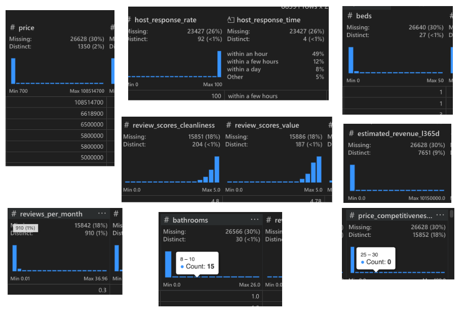

# My Capstone Project

Good Afternoon, Everyone!

It took me a long time to think about dataset, I wanted to work on. I wanted to genuinely be interested in the field. Having a massive interest in creating my own business, I wanted to look into property rentals like Airbnb. I wanted to work with the latest data, so I would be able to I'd geniunely be able to use these insights myself and be up to date. I wasn't able to find any airbnb data on kaggle so had to search around online, until i finally found a dateset on [insideairbnb.com](https://insideairbnb.com/)

I selected the Airbnb dataset because I wanted to approach it from a business perspective and uncover insights that could meaningfully influence host strategy, pricing decisions, and overall platform performance. Before jumping into analysis, I began with a thorough assessment of the data to understand its structure, limitations, and how much cleaning would be required.

The dataset is quite large, containing roughly 96,000 rows and 79 columns. As soon as I began exploring the columns, several issues became clear:

## 1. Significant Missing Data

One of the most biggest problems with this dataset was the extent of missing data. Some columns were missing 100% of their values—such as neighbourhood group, neighbourhood group cleansed, and license.

In addition to those, More than 14 more columns had over 30% missing values, which is substantial enough to impact analysis quality. This forced me to think carefully about which columns were actually necessary for the business insights I wanted to generate. Some examples below:

## 2. Inconsistent Data Types & Formatting

There were also multiple noticeable inconsistencies in:

- Data types (e.g., numerical fields stored as objects)

- Text casing and formatting

- Date fields listed as strings

- Percentage-based metrics stored as text instead of numeric values

- etc.

## 3. Too Many Columns to Clean Individually

There was also too many columns in this dataset. I intially spent the first 2 days, trying to clean and standardise all of them. but realised that it would not be possible in this time frame. So I had a plan to:

> "Identify the insights first, then determine which columns support those insights.""

This approach allowed me to narrow the dataset down to 27 key variables, significantly streamlining the cleaning process and ensuring that all effort went toward actionable, business-focused outcomes.

I will now break down my story based on the ETL pipeline.
