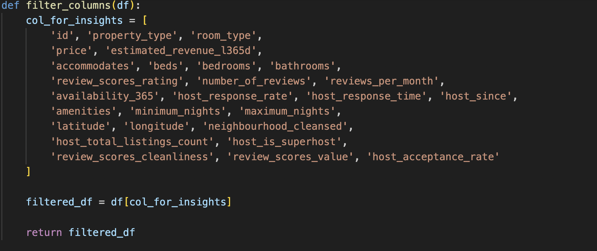
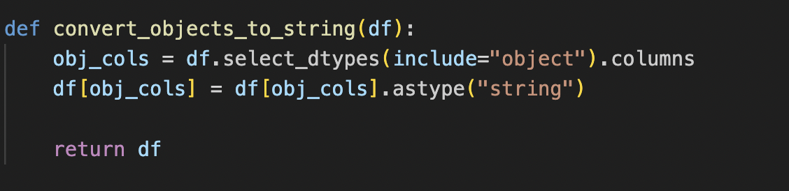
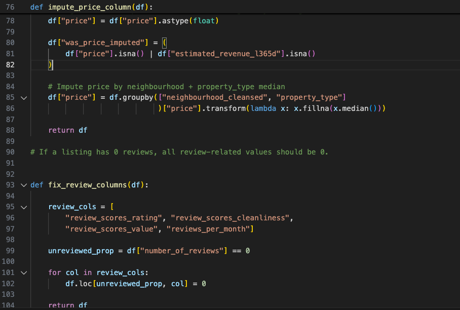

## TRANSFORM: PROJECT REQUIREMENTS

## EPIC 2

```text
As a Data Analyst/Scientist,
I want clean, standardised, enriched, and imputed Airbnb listing data,
So that the dataset is accurate, reliable, and ready for deeper analysis.
```

## EPIC 2 BREAKDOWN

### USER STORY 2 — Clean & Standardise Airbnb Listings Data

```text
As a Data Analyst/Scientist,
I want all listing fields to be cleaned and standardised,
So that the data is consistent and can be processed reliably.
```

### ACCEPTANCE CRITERIA:

- Object columns converted to string

- Price parsed from "$150.00" → int

- Bedrooms/beds parsed to int

- Host response/acceptance rates parsed from "95%" → 95

- Dates converted to datetime

- Invalid rows dropped using missingness threshold

- Amenities cleaned into a list format with brackets & quotes removed

- Functions are modular and testable

- Errors are handled gracefully

### USER STORY 3 — Impute Missing Structural, Review, and Pricing Fields

```text
As a Data Analyst/Scientist,
I want missing values (beds, bathrooms, price, review metrics) to be intelligently imputed,
So that the dataset remains complete and analysis remains accurate.
```

### ACCEPTANCE CRITERIA

- Beds renamed to minimum_beds

- minimum_beds is imputed using bedrooms when missing

- Bathrooms imputed using bedroom-based guidelines

- Listings with 0 reviews have rating-related fields set to 0

- Price is imputed using neighbourhood + property_type medians

- Imputation flag columns are added:

- was_price_imputed

- was_beds_imputed

- was_bathrooms_imputed

- No non-missing values are overwritten

- All imputations are validated by tests

### USER STORY 4 — Remove Low-Quality Listings

```text
As a Data Analyst/Scientist,
I want to remove listings with extremely incomplete data,
So that downstream analysis is not affected by low-quality records.
```

### ACCEPTANCE CRITERIA

- Missingness threshold logic implemented

- Rows exceeding the threshold are removed

- Remaining rows contain enough usable data

- Threshold is configurable (default 22%)

### USER STORY 5 — Engineer Business Features

```text
As a Data Analyst/Scientist,
I want new business insights to be added to the dataset,
So that pricing, occupancy, and competitiveness analysis can be performed.
```

### ACCEPTANCE CRITERIA

- Price Competitiveness (100%) feature added

- Occupancy Potential score added

- Both features normalised and validated

- Cleaning occurs before feature engineering

- Engineered fields have clear business meaning

- Tests verify correct calculation




